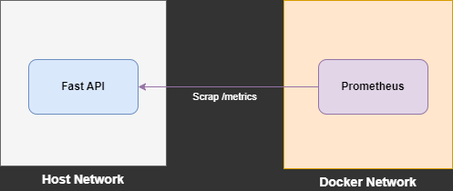

# ⚡ FastAPI에서 Prometheus 사용하기 샘플 코드

## 📘 개요 
Docker를 사용하여 Prometheus 서버를 구동하고 호스트에서는 FastAPI를 사용하여 웹 서버를 실행합니다.   
백엔드 개발에 중점을 둔 것으로 로그 출력과 Prometheus의 스크랩 동작을 확인하는 것을 목표로 합니다.



## 💻 설치
더 자세한 내용은 🚀 [블로그 설명](https://yscho03.tistory.com/325) 글을 참고하길 바랍니다.

### 1. Docker로 Promethues 서버 설치
```
$ export HOST_IP=$(echo `hostname -I | awk '{print $1}'`)
$ docker-compose up -d
```

### 2. FastAPI 환경 설치
```
$ pip install -r requirements.txt
```

### 3. FastAPI 웹 서버 기동
#### 기본은 8000포트이고 변경시는 config/prometheus/prometheus.yml 안의 port도 수정하셔야 합니다.
```
$ uvicorn main:app --host=0.0.0.0 --port=8000
```

### 4. FastAPI /metrics 확인
브라우저 또는 curl를 호출하여 [http://localhost:8000/metrics](http://localhost:8000/metrics) metric을 정상적으로 출력하고 있는지 확인합니다.
```
...
http_requests_total{handler="/api/v1/health",method="GET",status="2xx"} 1.0
http_request_duration_seconds_bucket{handler="/api/v1/health",le="0.1",method="GET"} 1.0
...
```

## ✅ 확인
### Promethues 로그 확인
로그 스크랩이 정상적으로 잘 동작하면 별다른 출력을 하지 않습니다.
```
ts=2024-02-04T00:28:41.267Z caller=main.go:1282 level=info msg="Completed loading of configuration file" filename=/etc/prometheus/prometheus.yml totalDuration=43.533308ms db_storage=1.44µs remote_storage=1.888µs web_handler=504ns query_engine=1µs scrape=25.986125ms scrape_sd=200.677µs notify=1.567µs notify_sd=4.126µs rules=1.575µs tracing=16.302µs
ts=2024-02-04T00:28:41.267Z caller=main.go:1024 level=info msg="Server is ready to receive web requests."
ts=2024-02-04T00:28:41.268Z caller=manager.go:212 level=debug component="discovery manager scrape" msg="Discoverer channel closed" provider=static/0
ts=2024-02-04T00:28:41.268Z caller=manager.go:146 level=info component="rule manager" msg="Starting rule manager..."
```
### FastAPI 로그 출력 확인
설정된 스크랩 주기 시간에 맞추어 다음과 같이 /metrics를 호출하여 스크랩을 합니다.
```
INFO:     Started server process [1514]
INFO:     Waiting for application startup.
INFO:     Application startup complete.
INFO:     Uvicorn running on http://0.0.0.0:8000 (Press CTRL+C to quit)
INFO:     172.18.0.2:39004 - "GET /metrics HTTP/1.1" 200 OK
INFO:     172.18.0.2:39004 - "GET /metrics HTTP/1.1" 200 OK
```

## ❌ 오류
### FastAPI 로그 출력 확인
Promethues 서버에서 host의 로그를 스크랩하지 못하는 경우입니다. 
```
$ docker logs -f <container-id>

ts=2024-02-04T00:28:51.143Z caller=scrape.go:1274 level=debug component="scrape manager" scrape_pool=sample target=http://host.docker.internal:8000/metrics msg="Scrape failed" err="Get \"http://host.docker.internal:8000/metrics\": dial tcp 20.100.0.101:8000: connect: connection refused"
```
다음과 같은 경우에는 docker 컨테이너 안의 /etc/hosts를 확인하여 host 도메인 설정이 잘 되어 있는지 확인합니다. host.docker.internal 부분 확인하시면 됩니다.
```
$ docker exec -it <container-id> sh  
/prometheus $ cat /etc/hosts

/prometheus $ cat /etc/hosts
127.0.0.1	localhost
::1	localhost ip6-localhost ip6-loopback
fe00::0	ip6-localnet
ff00::0	ip6-mcastprefix
ff02::1	ip6-allnodes
ff02::2	ip6-allrouters
<HOST_IP>	host.docker.internal 
172.18.0.2	ca56b8cb6211
```